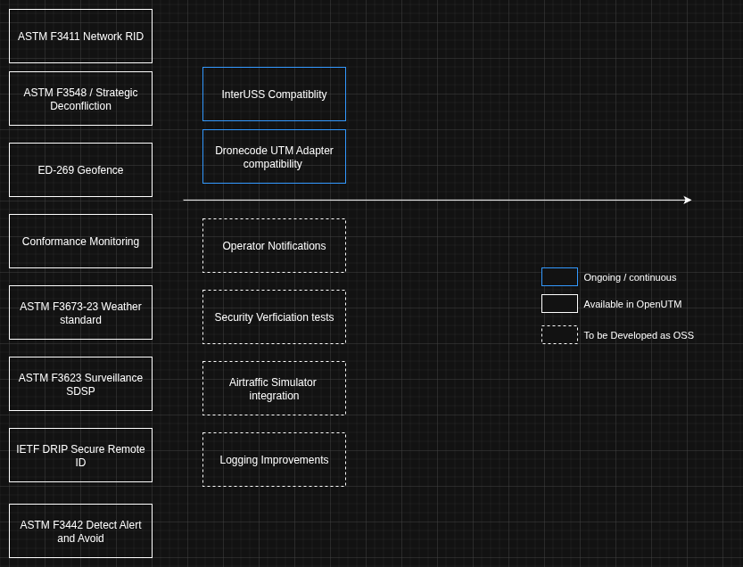

# Flight Blender

Flight Blender is an open-source backend and data-processing engine designed to support standards-compliant UTM (Unmanned Traffic Management) services. It adheres to the latest regulations for UTM/U-Space in the EU and other jurisdictions. With Flight Blender, you can:

- Implement a Remote ID "service provider" compatible with the ASTM-F3411 Remote ID standard, along with Flight Spotlight, an open-source Remote ID Display Application.
- Use an open-source implementation of the ASTM F3548 USS-to-USS standard, compatible with EU U-Space regulations for flight authorization.
- Interact with interoperability software like `interuss/dss` to exchange data with other UTM systems.
- Process geo-fences using the ED-269 standard.
- Monitor conformance and send operator notifications.
- Aggregate flight traffic feeds from various sources, including geo-fences, flight declarations, and air-traffic data.
- Configure Blender to act as a Surveillance SDSP per the ASTM F3623-23 standard.
- Implement alerts / near misses per the ASTM F3442 standard

## Key Features

### DSS Connectivity
Connect and retrieve data such as Remote ID information or perform strategic de-confliction and flight authorization.

### Flight Tracking
Ingest flight tracking feeds from sources like ADS-B, live telemetry, and Broadcast Remote ID. Outputs a unified JSON feed for real-time display.

### Geofence Management
Submit geofence to Flight Blender, which can then be transmitted to Spotlight for visualization.

### Flight Declaration
Submit future flight plans (up to 24 hours in advance) using the ASTM USS-to-USS API or as a standalone component. Supported DSS APIs are listed below.

### Network Remote ID
Compliant with ASTM standards, this module can act as a "display provider" or "service provider" for Network Remote ID.

### Operator Notifications
Send notifications to operators using an AMQP queue, enabling real-time alerts for flight updates, conformance issues, or other critical events.

### Conformance Monitoring
Monitor flight paths against declared 4D volumes for conformance and report outputs.

### Surveillance SDSP
Blender conforms to the requirements for Surveillance supplemental data service providers (SDSPs) and associated equipment and services.

### Detect, Alert and Avoid
Flight Blender implements the Detect Alert and Avoid standard F3442

## Roadmap

The image above details a general roadmap to standards compatibility. To monitor activities and track progress effectively, issues are the best way to manage and see the current work . 

---

## ▶️ Get Started in 20 Minutes

Follow our simple 5-step guide to deploy Flight Blender and explore its core features.

📖 [Read the 20-minute quickstart guide](deployment_support/README.md) to get started now!

---
## 💫 Join the community
[Discord](https://discord.gg/dnRxpZdd9a)

---

## Technical Resources and Background Information

- **API Specification**: Explore the [API documentation](http://redocly.github.io/redoc/?url=https://raw.githubusercontent.com/openutm/flight-blender/master/api/flight-blender-server-1.0.0-resolved.yaml) to understand available endpoints and data interactions.
- **Flight Tracking Data**: Review the [Air-traffic Data Protocol](https://github.com/openutm-labs/airtraffic-data-protocol-development/blob/master/Airtraffic-Data-Protocol.md).

---

## Flight Blender Verification
Flight Blender includes a robust verification framework to ensure your deployment operates as expected. Explore the [verification](https://github.com/openutm/verification) repository to use and create verification scenarios. Additionally, Flight Blender is fully compliant with the InterUSS Monitoring test suite.

---

Flight Blender is your gateway to building robust, standards-compliant UTM services. Start exploring today!
